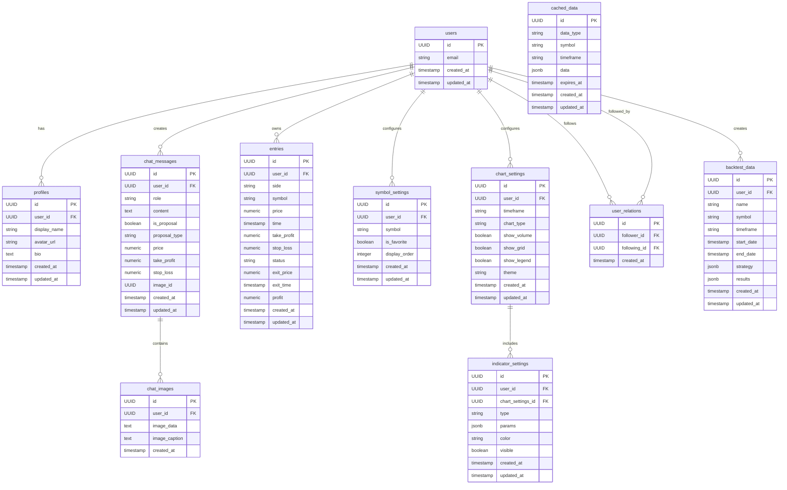

# Supabaseデータベースアーキテクチャ設計 - tradechat-mvp

## 1. プロジェクト概要

tradechat-mvpは、仮想通貨のトレーディングチャットアプリケーションであり、以下の主要な機能を持っています：

- チャート表示機能（ローソク足チャート、テクニカル指標、描画ツールなど）
- チャット機能（AIとのチャット、トレード提案など）
- マーケットデータ表示機能（オーダーブック、取引履歴など）
- トレードエントリー管理機能（ポジションの作成、管理、クローズなど）
- 外部API連携機能（Bitget APIとの連携）

このドキュメントでは、tradechat-mvpプロジェクトのためのSupabaseデータベースアーキテクチャを詳細に設計します。

## 2. エンティティの定義と属性

### 2.1 ユーザー (users)

Supabaseの認証機能と連携し、メール/パスワードとGoogleログインをサポートします。

```sql
-- Supabaseが自動的に作成するテーブル
-- auth.usersテーブルと連携
CREATE TABLE users (
  id UUID PRIMARY KEY REFERENCES auth.users(id) ON DELETE CASCADE,
  email TEXT UNIQUE NOT NULL,
  created_at TIMESTAMP WITH TIME ZONE DEFAULT NOW(),
  updated_at TIMESTAMP WITH TIME ZONE DEFAULT NOW(),
  settings JSONB DEFAULT '{}'::jsonb
);
```

### 2.2 プロフィール (profiles)

ユーザーの詳細情報を保存します。

```sql
CREATE TABLE profiles (
  id UUID PRIMARY KEY,
  user_id UUID REFERENCES users(id) ON DELETE CASCADE,
  display_name TEXT,
  avatar_url TEXT,
  bio TEXT,
  created_at TIMESTAMP WITH TIME ZONE DEFAULT NOW(),
  updated_at TIMESTAMP WITH TIME ZONE DEFAULT NOW()
);
```

### 2.3 チャットメッセージ (chat_messages)

AIとのチャット履歴やトレード提案情報を保存します。

```sql
CREATE TABLE chat_messages (
  id UUID PRIMARY KEY DEFAULT gen_random_uuid(),
  user_id UUID REFERENCES users(id) ON DELETE CASCADE,
  role TEXT NOT NULL CHECK (role IN ('user', 'assistant')),
  content TEXT NOT NULL,
  is_proposal BOOLEAN DEFAULT FALSE,
  proposal_type TEXT CHECK (proposal_type IN ('buy', 'sell') OR proposal_type IS NULL),
  price NUMERIC,
  take_profit NUMERIC,
  stop_loss NUMERIC,
  image_id UUID REFERENCES chat_images(id) ON DELETE SET NULL,
  created_at TIMESTAMP WITH TIME ZONE DEFAULT NOW(),
  updated_at TIMESTAMP WITH TIME ZONE DEFAULT NOW()
);
```

### 2.4 チャット画像 (chat_images)

チャットメッセージに添付される画像データを保存します。

```sql
CREATE TABLE chat_images (
  id UUID PRIMARY KEY DEFAULT gen_random_uuid(),
  user_id UUID REFERENCES users(id) ON DELETE CASCADE,
  image_data TEXT NOT NULL, -- Base64エンコードされた画像データ
  image_caption TEXT,
  created_at TIMESTAMP WITH TIME ZONE DEFAULT NOW()
);
```

### 2.5 トレードエントリー (entries)

ユーザーのトレードポジション情報を保存します。

```sql
CREATE TABLE entries (
  id UUID PRIMARY KEY DEFAULT gen_random_uuid(),
  user_id UUID REFERENCES users(id) ON DELETE CASCADE,
  side TEXT NOT NULL CHECK (side IN ('buy', 'sell')),
  symbol TEXT NOT NULL,
  price NUMERIC NOT NULL,
  time TIMESTAMP WITH TIME ZONE NOT NULL,
  take_profit NUMERIC,
  stop_loss NUMERIC,
  status TEXT NOT NULL CHECK (status IN ('open', 'closed', 'canceled')),
  exit_price NUMERIC,
  exit_time TIMESTAMP WITH TIME ZONE,
  profit NUMERIC,
  created_at TIMESTAMP WITH TIME ZONE DEFAULT NOW(),
  updated_at TIMESTAMP WITH TIME ZONE DEFAULT NOW()
);
```

### 2.6 シンボル設定 (symbol_settings)

ユーザーごとのシンボル設定を保存します。

```sql
CREATE TABLE symbol_settings (
  id UUID PRIMARY KEY DEFAULT gen_random_uuid(),
  user_id UUID REFERENCES users(id) ON DELETE CASCADE,
  symbol TEXT NOT NULL,
  is_favorite BOOLEAN DEFAULT FALSE,
  display_order INTEGER DEFAULT 0,
  created_at TIMESTAMP WITH TIME ZONE DEFAULT NOW(),
  updated_at TIMESTAMP WITH TIME ZONE DEFAULT NOW(),
  UNIQUE(user_id, symbol)
);
```

### 2.7 チャート設定 (chart_settings)

ユーザーごとのチャート表示設定を保存します。

```sql
CREATE TABLE chart_settings (
  id UUID PRIMARY KEY DEFAULT gen_random_uuid(),
  user_id UUID REFERENCES users(id) ON DELETE CASCADE,
  timeframe TEXT NOT NULL,
  chart_type TEXT NOT NULL,
  show_volume BOOLEAN DEFAULT TRUE,
  show_grid BOOLEAN DEFAULT TRUE,
  show_legend BOOLEAN DEFAULT TRUE,
  theme TEXT DEFAULT 'dark',
  created_at TIMESTAMP WITH TIME ZONE DEFAULT NOW(),
  updated_at TIMESTAMP WITH TIME ZONE DEFAULT NOW()
);
```

### 2.8 テクニカル指標設定 (indicator_settings)

ユーザーごとのテクニカル指標設定を保存します。

```sql
CREATE TABLE indicator_settings (
  id UUID PRIMARY KEY DEFAULT gen_random_uuid(),
  user_id UUID REFERENCES users(id) ON DELETE CASCADE,
  chart_settings_id UUID REFERENCES chart_settings(id) ON DELETE CASCADE,
  type TEXT NOT NULL,
  params JSONB NOT NULL DEFAULT '{}'::jsonb,
  color TEXT,
  visible BOOLEAN DEFAULT TRUE,
  created_at TIMESTAMP WITH TIME ZONE DEFAULT NOW(),
  updated_at TIMESTAMP WITH TIME ZONE DEFAULT NOW()
);
```

### 2.9 キャッシュデータ (cached_data)

外部APIから取得したデータのキャッシュを保存します。

```sql
CREATE TABLE cached_data (
  id UUID PRIMARY KEY DEFAULT gen_random_uuid(),
  data_type TEXT NOT NULL,
  symbol TEXT NOT NULL,
  timeframe TEXT,
  data JSONB NOT NULL,
  expires_at TIMESTAMP WITH TIME ZONE NOT NULL,
  created_at TIMESTAMP WITH TIME ZONE DEFAULT NOW(),
  updated_at TIMESTAMP WITH TIME ZONE DEFAULT NOW()
);
```

### 2.10 ユーザー関係 (user_relations)

将来的なソーシャル機能のためのフォロー関係を保存します。

```sql
CREATE TABLE user_relations (
  id UUID PRIMARY KEY DEFAULT gen_random_uuid(),
  follower_id UUID REFERENCES users(id) ON DELETE CASCADE,
  following_id UUID REFERENCES users(id) ON DELETE CASCADE,
  created_at TIMESTAMP WITH TIME ZONE DEFAULT NOW(),
  UNIQUE(follower_id, following_id)
);
```

### 2.11 バックテストデータ (backtest_data)

将来的なバックテスト機能のためのデータを保存します。

```sql
CREATE TABLE backtest_data (
  id UUID PRIMARY KEY DEFAULT gen_random_uuid(),
  user_id UUID REFERENCES users(id) ON DELETE CASCADE,
  name TEXT NOT NULL,
  symbol TEXT NOT NULL,
  timeframe TEXT NOT NULL,
  start_date TIMESTAMP WITH TIME ZONE NOT NULL,
  end_date TIMESTAMP WITH TIME ZONE NOT NULL,
  strategy JSONB NOT NULL,
  results JSONB NOT NULL,
  created_at TIMESTAMP WITH TIME ZONE DEFAULT NOW(),
  updated_at TIMESTAMP WITH TIME ZONE DEFAULT NOW()
);
```

## 3. エンティティ間のリレーション

エンティティ間の関係を以下のERD（エンティティ関係図）で示します：



## 4. 主キー・外部キー設計

### 4.1 主キー

すべてのテーブルで、UUIDタイプの`id`カラムを主キーとして使用します。これにより、以下の利点があります：

- グローバルに一意な識別子を保証
- 分散システムでの衝突を回避
- セキュリティ上の利点（連続的なIDではないため予測が困難）

### 4.2 外部キー

外部キーは、参照整合性を保証するために使用されます：

- `profiles.user_id` → `users.id`
- `chat_messages.user_id` → `users.id`
- `chat_messages.image_id` → `chat_images.id`
- `chat_images.user_id` → `users.id`
- `entries.user_id` → `users.id`
- `symbol_settings.user_id` → `users.id`
- `chart_settings.user_id` → `users.id`
- `indicator_settings.user_id` → `users.id`
- `indicator_settings.chart_settings_id` → `chart_settings.id`
- `user_relations.follower_id` → `users.id`
- `user_relations.following_id` → `users.id`
- `backtest_data.user_id` → `users.id`

### 4.3 カスケード削除

ユーザーが削除された場合、そのユーザーに関連するすべてのデータを自動的に削除するために、多くの外部キー制約に`ON DELETE CASCADE`を設定しています。これにより、データの整合性が保たれます。

## 5. テーブル構造と正規化戦略

### 5.1 正規化戦略

データベース設計では、以下の正規化戦略を採用しています：

#### 第1正規形 (1NF)
すべてのテーブルは第1正規形を満たしています：
- 各列は単一値を持ちます
- 繰り返しグループはありません
- 複雑なデータ構造は`jsonb`型を使用して保存します（例：`indicator_settings.params`, `backtest_data.strategy`）

#### 第2正規形 (2NF)
すべてのテーブルは第2正規形を満たしています：
- 非キー列は主キー全体に依存しています

#### 第3正規形 (3NF)
ほとんどのテーブルは第3正規形を満たしています：
- 非キー列は他の非キー列に依存していません
- ただし、パフォーマンスと使いやすさのために、一部のテーブルでは冗長性を許容しています

### 5.2 非正規化の戦略的採用

- `cached_data`テーブルは意図的に非正規化されています（パフォーマンス向上のため）
- `chat_messages`テーブルには提案関連の情報を含めています（クエリの複雑さを減らすため）
- `indicator_settings`テーブルには`user_id`と`chart_settings_id`の両方を含めています（クエリの効率化のため）

## 6. インデックス設計

パフォーマンス最適化のために、以下のインデックスを設計します：

### 6.1 chat_messages テーブル
```sql
CREATE INDEX idx_chat_messages_user_id ON chat_messages(user_id);
CREATE INDEX idx_chat_messages_created_at ON chat_messages(created_at);
CREATE INDEX idx_chat_messages_is_proposal ON chat_messages(is_proposal);
```

### 6.2 entries テーブル
```sql
CREATE INDEX idx_entries_user_id ON entries(user_id);
CREATE INDEX idx_entries_status ON entries(status);
CREATE INDEX idx_entries_symbol ON entries(symbol);
CREATE INDEX idx_entries_user_status ON entries(user_id, status);
```

### 6.3 symbol_settings テーブル
```sql
CREATE UNIQUE INDEX idx_symbol_settings_user_symbol ON symbol_settings(user_id, symbol);
CREATE INDEX idx_symbol_settings_is_favorite ON symbol_settings(is_favorite);
```

### 6.4 cached_data テーブル
```sql
CREATE INDEX idx_cached_data_composite ON cached_data(data_type, symbol, timeframe);
CREATE INDEX idx_cached_data_expires_at ON cached_data(expires_at);
```

### 6.5 user_relations テーブル
```sql
CREATE INDEX idx_user_relations_follower ON user_relations(follower_id);
CREATE INDEX idx_user_relations_following ON user_relations(following_id);
CREATE UNIQUE INDEX idx_user_relations_unique ON user_relations(follower_id, following_id);
```

## 7. パフォーマンス最適化方針

### 7.1 適切なインデックス設計
- 上記のインデックス設計に基づいて、頻繁に使用されるクエリを最適化します
- クエリパターンの変化に応じてインデックスを定期的に見直します

### 7.2 キャッシュ戦略
- 外部APIから取得したデータを`cached_data`テーブルに保存します
- 期限切れのキャッシュデータを定期的に削除するバックグラウンドジョブを実装します
- キャッシュの有効期限は、データの種類に応じて適切に設定します

### 7.3 ページネーション
- チャットメッセージやエントリーなど、大量のデータを扱うクエリにはページネーションを実装します
- Supabaseの`range`ヘッダーを活用して効率的なページネーションを実現します

### 7.4 選択的データ取得
- 必要なカラムのみを選択してデータ転送量を削減します
- 大きな`JSONB`フィールドは必要な場合のみ取得します

### 7.5 Supabaseのリアルタイム機能の活用
- チャットメッセージやエントリーの更新をリアルタイムで反映するために、Supabaseのリアルタイム機能を活用します
- 適切なチャネルとフィルターを設定して、必要なデータのみをサブスクライブします

### 7.6 RLSポリシー
- 各テーブルに適切なRow Level Security（RLS）ポリシーを設定して、データのセキュリティを確保します
- ユーザーは自分のデータのみにアクセスできるようにします

## 8. 将来的な拡張性

### 8.1 ソーシャル機能
- `user_relations`テーブルを活用して、ユーザー間のフォロー関係を管理します
- 将来的には、共有機能やコメント機能を追加することも可能です

### 8.2 バックテスト機能
- `backtest_data`テーブルを活用して、トレード戦略のバックテスト結果を保存します
- 複雑な戦略パラメータは`JSONB`型で柔軟に保存できます

### 8.3 通知システム
- 将来的に通知機能を追加する場合は、以下のようなテーブルを追加します：
```sql
CREATE TABLE notifications (
  id UUID PRIMARY KEY DEFAULT gen_random_uuid(),
  user_id UUID REFERENCES users(id) ON DELETE CASCADE,
  type TEXT NOT NULL,
  content JSONB NOT NULL,
  is_read BOOLEAN DEFAULT FALSE,
  created_at TIMESTAMP WITH TIME ZONE DEFAULT NOW()
);
```

## 9. まとめ

このSupabaseデータベースアーキテクチャは、tradechat-mvpプロジェクトの要件を満たすように設計されています。ユーザー認証、チャットメッセージ、トレードエントリー、チャート設定などの主要機能をサポートし、将来的な拡張性も考慮しています。

適切な正規化戦略とインデックス設計により、パフォーマンスと柔軟性のバランスが取れたデータベース構造となっています。また、Supabaseの強力な機能（認証、リアルタイム更新、RLSなど）を活用することで、安全で効率的なアプリケーション開発が可能です。