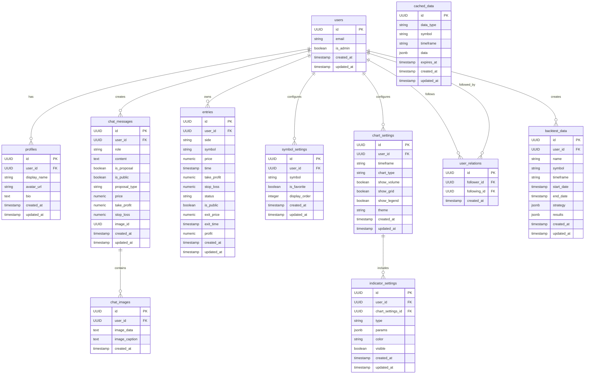
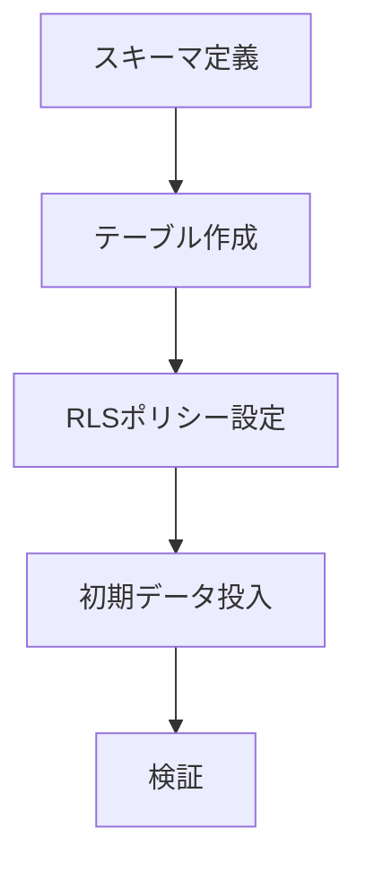
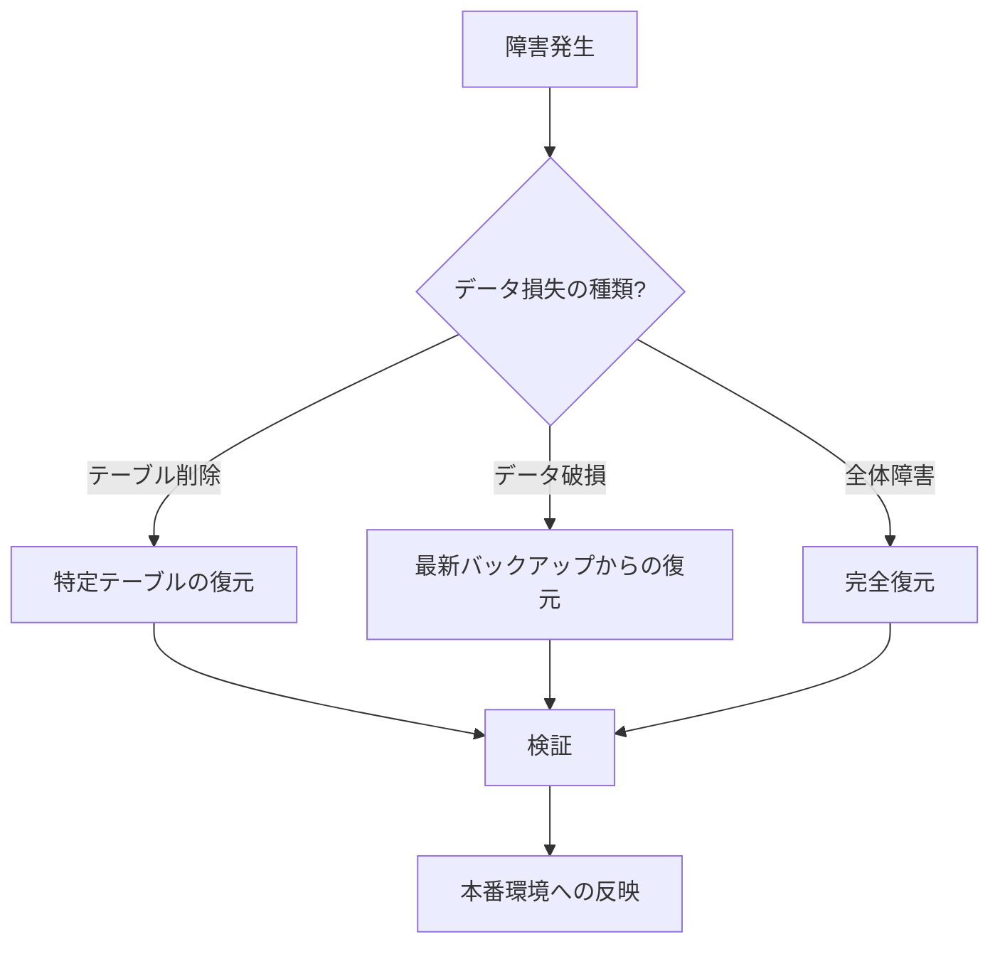

# Supabaseデータベース実装計画書 - tradechat-mvp

## 目次

1. [プロジェクト概要](#1-プロジェクト概要)
2. [データモデル設計](#2-データモデル設計)
   1. [エンティティの定義と属性](#21-エンティティの定義と属性)
   2. [エンティティ間のリレーション](#22-エンティティ間のリレーション)
   3. [主キー・外部キー設計](#23-主キー外部キー設計)
   4. [テーブル構造と正規化戦略](#24-テーブル構造と正規化戦略)
   5. [インデックス設計](#25-インデックス設計)
3. [セキュリティとRLSポリシー設計](#3-セキュリティとrlsポリシー設計)
   1. [基本方針](#31-基本方針)
   2. [各テーブルのRLSポリシー](#32-各テーブルのrlsポリシー)
   3. [認証機能との連携](#33-認証機能との連携)
   4. [セキュリティリスクとその対策](#34-セキュリティリスクとその対策)
4. [マイグレーション戦略](#4-マイグレーション戦略)
   1. [初期データベース構築](#41-初期データベース構築)
   2. [継続的なマイグレーション管理](#42-継続的なマイグレーション管理)
5. [バックアップと復旧計画](#5-バックアップと復旧計画)
   1. [バックアップ戦略](#51-バックアップ戦略)
   2. [復旧計画](#52-復旧計画)
6. [スケーラビリティ考慮事項](#6-スケーラビリティ考慮事項)
   1. [データ量の増加への対応](#61-データ量の増加への対応)
   2. [アクセス数の増加への対応](#62-アクセス数の増加への対応)
   3. [Supabaseのリアルタイム機能の最適化](#63-supabaseのリアルタイム機能の最適化)
7. [実装フェーズとタイムライン](#7-実装フェーズとタイムライン)
8. [テスト戦略](#8-テスト戦略)
9. [運用ガイドラインとベストプラクティス](#9-運用ガイドラインとベストプラクティス)
10. [リスクと緩和策](#10-リスクと緩和策)
11. [成功基準と評価指標](#11-成功基準と評価指標)

## 1. プロジェクト概要

tradechat-mvpは、仮想通貨のトレーディングチャットアプリケーションであり、以下の主要な機能を持っています：

- チャート表示機能（ローソク足チャート、テクニカル指標、描画ツールなど）
- チャット機能（AIとのチャット、トレード提案など）
- マーケットデータ表示機能（オーダーブック、取引履歴など）
- トレードエントリー管理機能（ポジションの作成、管理、クローズなど）
- 外部API連携機能（Bitget APIとの連携）

このドキュメントでは、tradechat-mvpプロジェクトのためのSupabaseデータベースアーキテクチャと実装計画を詳細に設計します。
## 2. データモデル設計

### 2.1 エンティティの定義と属性

#### 2.1.1 ユーザー (users)

Supabaseの認証機能と連携し、メール/パスワードとGoogleログインをサポートします。

```sql
-- Supabaseが自動的に作成するテーブル
-- auth.usersテーブルと連携
CREATE TABLE users (
  id UUID PRIMARY KEY REFERENCES auth.users(id) ON DELETE CASCADE,
  email TEXT UNIQUE NOT NULL,
  is_admin BOOLEAN DEFAULT FALSE,
  created_at TIMESTAMP WITH TIME ZONE DEFAULT NOW(),
  updated_at TIMESTAMP WITH TIME ZONE DEFAULT NOW(),
  settings JSONB DEFAULT '{}'::jsonb
);
```

#### 2.1.2 プロフィール (profiles)

ユーザーの詳細情報を保存します。

```sql
CREATE TABLE profiles (
  id UUID PRIMARY KEY,
  user_id UUID REFERENCES users(id) ON DELETE CASCADE,
  display_name TEXT,
  avatar_url TEXT,
  bio TEXT,
  created_at TIMESTAMP WITH TIME ZONE DEFAULT NOW(),
  updated_at TIMESTAMP WITH TIME ZONE DEFAULT NOW()
);
```

#### 2.1.3 チャットメッセージ (chat_messages)

AIとのチャット履歴やトレード提案情報を保存します。

```sql
CREATE TABLE chat_messages (
  id UUID PRIMARY KEY DEFAULT gen_random_uuid(),
  user_id UUID REFERENCES users(id) ON DELETE CASCADE,
  role TEXT NOT NULL CHECK (role IN ('user', 'assistant')),
  content TEXT NOT NULL,
  is_proposal BOOLEAN DEFAULT FALSE,
  is_public BOOLEAN DEFAULT FALSE,
  proposal_type TEXT CHECK (proposal_type IN ('buy', 'sell') OR proposal_type IS NULL),
  price NUMERIC,
  take_profit NUMERIC,
  stop_loss NUMERIC,
  image_id UUID REFERENCES chat_images(id) ON DELETE SET NULL,
  created_at TIMESTAMP WITH TIME ZONE DEFAULT NOW(),
  updated_at TIMESTAMP WITH TIME ZONE DEFAULT NOW()
);
```

#### 2.1.4 チャット画像 (chat_images)

チャットメッセージに添付される画像データを保存します。

```sql
CREATE TABLE chat_images (
  id UUID PRIMARY KEY DEFAULT gen_random_uuid(),
  user_id UUID REFERENCES users(id) ON DELETE CASCADE,
  image_data TEXT NOT NULL, -- Base64エンコードされた画像データ
  image_caption TEXT,
  created_at TIMESTAMP WITH TIME ZONE DEFAULT NOW()
);
```

#### 2.1.5 トレードエントリー (entries)

ユーザーのトレードポジション情報を保存します。

```sql
CREATE TABLE entries (
  id UUID PRIMARY KEY DEFAULT gen_random_uuid(),
  user_id UUID REFERENCES users(id) ON DELETE CASCADE,
  side TEXT NOT NULL CHECK (side IN ('buy', 'sell')),
  symbol TEXT NOT NULL,
  price NUMERIC NOT NULL,
  time TIMESTAMP WITH TIME ZONE NOT NULL,
  take_profit NUMERIC,
  stop_loss NUMERIC,
  status TEXT NOT NULL CHECK (status IN ('open', 'closed', 'canceled')),
  is_public BOOLEAN DEFAULT FALSE,
  exit_price NUMERIC,
  exit_time TIMESTAMP WITH TIME ZONE,
  profit NUMERIC,
  created_at TIMESTAMP WITH TIME ZONE DEFAULT NOW(),
  updated_at TIMESTAMP WITH TIME ZONE DEFAULT NOW()
);
```

#### 2.1.6 シンボル設定 (symbol_settings)

ユーザーごとのシンボル設定を保存します。

```sql
CREATE TABLE symbol_settings (
  id UUID PRIMARY KEY DEFAULT gen_random_uuid(),
  user_id UUID REFERENCES users(id) ON DELETE CASCADE,
  symbol TEXT NOT NULL,
  is_favorite BOOLEAN DEFAULT FALSE,
  display_order INTEGER DEFAULT 0,
  created_at TIMESTAMP WITH TIME ZONE DEFAULT NOW(),
  updated_at TIMESTAMP WITH TIME ZONE DEFAULT NOW(),
  UNIQUE(user_id, symbol)
);
```

#### 2.1.7 チャート設定 (chart_settings)

ユーザーごとのチャート表示設定を保存します。

```sql
CREATE TABLE chart_settings (
  id UUID PRIMARY KEY DEFAULT gen_random_uuid(),
  user_id UUID REFERENCES users(id) ON DELETE CASCADE,
  timeframe TEXT NOT NULL,
  chart_type TEXT NOT NULL,
  show_volume BOOLEAN DEFAULT TRUE,
  show_grid BOOLEAN DEFAULT TRUE,
  show_legend BOOLEAN DEFAULT TRUE,
  theme TEXT DEFAULT 'dark',
  created_at TIMESTAMP WITH TIME ZONE DEFAULT NOW(),
  updated_at TIMESTAMP WITH TIME ZONE DEFAULT NOW()
);
```

#### 2.1.8 テクニカル指標設定 (indicator_settings)

ユーザーごとのテクニカル指標設定を保存します。

```sql
CREATE TABLE indicator_settings (
  id UUID PRIMARY KEY DEFAULT gen_random_uuid(),
  user_id UUID REFERENCES users(id) ON DELETE CASCADE,
  chart_settings_id UUID REFERENCES chart_settings(id) ON DELETE CASCADE,
  type TEXT NOT NULL,
  params JSONB NOT NULL DEFAULT '{}'::jsonb,
  color TEXT,
  visible BOOLEAN DEFAULT TRUE,
  created_at TIMESTAMP WITH TIME ZONE DEFAULT NOW(),
  updated_at TIMESTAMP WITH TIME ZONE DEFAULT NOW()
);
```

#### 2.1.9 キャッシュデータ (cached_data)

外部APIから取得したデータのキャッシュを保存します。

```sql
CREATE TABLE cached_data (
  id UUID PRIMARY KEY DEFAULT gen_random_uuid(),
  data_type TEXT NOT NULL,
  symbol TEXT NOT NULL,
  timeframe TEXT,
  data JSONB NOT NULL,
  expires_at TIMESTAMP WITH TIME ZONE NOT NULL,
  created_at TIMESTAMP WITH TIME ZONE DEFAULT NOW(),
  updated_at TIMESTAMP WITH TIME ZONE DEFAULT NOW()
);
```

#### 2.1.10 ユーザー関係 (user_relations)

将来的なソーシャル機能のためのフォロー関係を保存します。

```sql
CREATE TABLE user_relations (
  id UUID PRIMARY KEY DEFAULT gen_random_uuid(),
  follower_id UUID REFERENCES users(id) ON DELETE CASCADE,
  following_id UUID REFERENCES users(id) ON DELETE CASCADE,
  created_at TIMESTAMP WITH TIME ZONE DEFAULT NOW(),
  UNIQUE(follower_id, following_id)
);
```

#### 2.1.11 バックテストデータ (backtest_data)

将来的なバックテスト機能のためのデータを保存します。

```sql
CREATE TABLE backtest_data (
  id UUID PRIMARY KEY DEFAULT gen_random_uuid(),
  user_id UUID REFERENCES users(id) ON DELETE CASCADE,
  name TEXT NOT NULL,
  symbol TEXT NOT NULL,
  timeframe TEXT NOT NULL,
  start_date TIMESTAMP WITH TIME ZONE NOT NULL,
  end_date TIMESTAMP WITH TIME ZONE NOT NULL,
  strategy JSONB NOT NULL,
  results JSONB NOT NULL,
  created_at TIMESTAMP WITH TIME ZONE DEFAULT NOW(),
  updated_at TIMESTAMP WITH TIME ZONE DEFAULT NOW()
);
```
### 2.2 エンティティ間のリレーション

エンティティ間の関係を以下のERD（エンティティ関係図）で示します：



### 2.3 主キー・外部キー設計

#### 2.3.1 主キー

すべてのテーブルで、UUIDタイプの`id`カラムを主キーとして使用します。これにより、以下の利点があります：

- グローバルに一意な識別子を保証
- 分散システムでの衝突を回避
- セキュリティ上の利点（連続的なIDではないため予測が困難）

#### 2.3.2 外部キー

外部キーは、参照整合性を保証するために使用されます：

- `profiles.user_id` → `users.id`
- `chat_messages.user_id` → `users.id`
- `chat_messages.image_id` → `chat_images.id`
- `chat_images.user_id` → `users.id`
- `entries.user_id` → `users.id`
- `symbol_settings.user_id` → `users.id`
- `chart_settings.user_id` → `users.id`
- `indicator_settings.user_id` → `users.id`
- `indicator_settings.chart_settings_id` → `chart_settings.id`
- `user_relations.follower_id` → `users.id`
- `user_relations.following_id` → `users.id`
- `backtest_data.user_id` → `users.id`

#### 2.3.3 カスケード削除

ユーザーが削除された場合、そのユーザーに関連するすべてのデータを自動的に削除するために、多くの外部キー制約に`ON DELETE CASCADE`を設定しています。これにより、データの整合性が保たれます。

### 2.4 テーブル構造と正規化戦略

#### 2.4.1 正規化戦略

データベース設計では、以下の正規化戦略を採用しています：

##### 第1正規形 (1NF)
すべてのテーブルは第1正規形を満たしています：
- 各列は単一値を持ちます
- 繰り返しグループはありません
- 複雑なデータ構造は`jsonb`型を使用して保存します（例：`indicator_settings.params`, `backtest_data.strategy`）

##### 第2正規形 (2NF)
すべてのテーブルは第2正規形を満たしています：
- 非キー列は主キー全体に依存しています

##### 第3正規形 (3NF)
ほとんどのテーブルは第3正規形を満たしています：
- 非キー列は他の非キー列に依存していません
- ただし、パフォーマンスと使いやすさのために、一部のテーブルでは冗長性を許容しています

#### 2.4.2 非正規化の戦略的採用

- `cached_data`テーブルは意図的に非正規化されています（パフォーマンス向上のため）
- `chat_messages`テーブルには提案関連の情報を含めています（クエリの複雑さを減らすため）
- `indicator_settings`テーブルには`user_id`と`chart_settings_id`の両方を含めています（クエリの効率化のため）

### 2.5 インデックス設計

パフォーマンス最適化のために、以下のインデックスを設計します：

#### 2.5.1 chat_messages テーブル
```sql
CREATE INDEX idx_chat_messages_user_id ON chat_messages(user_id);
CREATE INDEX idx_chat_messages_created_at ON chat_messages(created_at);
CREATE INDEX idx_chat_messages_is_proposal ON chat_messages(is_proposal);
CREATE INDEX idx_chat_messages_is_public ON chat_messages(is_public);
```

#### 2.5.2 entries テーブル
```sql
CREATE INDEX idx_entries_user_id ON entries(user_id);
CREATE INDEX idx_entries_status ON entries(status);
CREATE INDEX idx_entries_symbol ON entries(symbol);
CREATE INDEX idx_entries_user_status ON entries(user_id, status);
CREATE INDEX idx_entries_is_public ON entries(is_public);
```

#### 2.5.3 symbol_settings テーブル
```sql
CREATE UNIQUE INDEX idx_symbol_settings_user_symbol ON symbol_settings(user_id, symbol);
CREATE INDEX idx_symbol_settings_is_favorite ON symbol_settings(is_favorite);
```

#### 2.5.4 cached_data テーブル
```sql
CREATE INDEX idx_cached_data_composite ON cached_data(data_type, symbol, timeframe);
CREATE INDEX idx_cached_data_expires_at ON cached_data(expires_at);
```

#### 2.5.5 user_relations テーブル
```sql
CREATE INDEX idx_user_relations_follower ON user_relations(follower_id);
CREATE INDEX idx_user_relations_following ON user_relations(following_id);
CREATE UNIQUE INDEX idx_user_relations_unique ON user_relations(follower_id, following_id);
```
## 3. セキュリティとRLSポリシー設計

### 3.1 基本方針

- 最小権限の原則：ユーザーは必要最小限のデータにのみアクセス可能
- データの所有権：基本的に自分のデータのみアクセス可能
- 公開/非公開の区別：公開設定されたデータは他のユーザーも閲覧可能
- 管理者特権：管理者はすべてのデータにアクセス可能
- RLSポリシーは「OR」条件で評価：どれか1つのポリシーが「true」を返せばアクセス許可

### 3.2 各テーブルのRLSポリシー

#### 3.2.1 users テーブル
```sql
-- RLSを有効化
ALTER TABLE users ENABLE ROW LEVEL SECURITY;

-- 自分自身のデータのみ読み取り可能
CREATE POLICY "ユーザーは自分のデータのみ閲覧可能" ON users
  FOR SELECT USING (auth.uid() = id);

-- 自分自身のデータのみ更新可能
CREATE POLICY "ユーザーは自分のデータのみ更新可能" ON users
  FOR UPDATE USING (auth.uid() = id);

-- 管理者はすべてのユーザーデータにアクセス可能
CREATE POLICY "管理者はすべてのユーザーデータにアクセス可能" ON users
  FOR ALL USING (auth.uid() IN (SELECT id FROM users WHERE is_admin = true));
```

#### 3.2.2 profiles テーブル
```sql
-- RLSを有効化
ALTER TABLE profiles ENABLE ROW LEVEL SECURITY;

-- 自分のプロフィールは読み書き可能
CREATE POLICY "ユーザーは自分のプロフィールを管理可能" ON profiles
  FOR ALL USING (auth.uid() = user_id);

-- 公開プロフィールは誰でも閲覧可能
CREATE POLICY "公開プロフィールは誰でも閲覧可能" ON profiles
  FOR SELECT USING (true);

-- 管理者はすべてのプロフィールにアクセス可能
CREATE POLICY "管理者はすべてのプロフィールにアクセス可能" ON profiles
  FOR ALL USING (auth.uid() IN (SELECT id FROM users WHERE is_admin = true));
```

#### 3.2.3 chat_messages テーブル
```sql
-- RLSを有効化
ALTER TABLE chat_messages ENABLE ROW LEVEL SECURITY;

-- 自分のメッセージは読み書き可能
CREATE POLICY "ユーザーは自分のメッセージを管理可能" ON chat_messages
  FOR ALL USING (auth.uid() = user_id);

-- 公開メッセージは誰でも閲覧可能
CREATE POLICY "公開メッセージは誰でも閲覧可能" ON chat_messages
  FOR SELECT USING (is_public = true);

-- 管理者はすべてのメッセージにアクセス可能
CREATE POLICY "管理者はすべてのメッセージにアクセス可能" ON chat_messages
  FOR ALL USING (auth.uid() IN (SELECT id FROM users WHERE is_admin = true));
```

#### 3.2.4 chat_images テーブル
```sql
-- RLSを有効化
ALTER TABLE chat_images ENABLE ROW LEVEL SECURITY;

-- 自分の画像は読み書き可能
CREATE POLICY "ユーザーは自分の画像を管理可能" ON chat_images
  FOR ALL USING (auth.uid() = user_id);

-- 公開メッセージに関連する画像は誰でも閲覧可能
CREATE POLICY "公開メッセージの画像は誰でも閲覧可能" ON chat_images
  FOR SELECT USING (
    id IN (
      SELECT image_id FROM chat_messages 
      WHERE is_public = true AND image_id IS NOT NULL
    )
  );

-- 管理者はすべての画像にアクセス可能
CREATE POLICY "管理者はすべての画像にアクセス可能" ON chat_images
  FOR ALL USING (auth.uid() IN (SELECT id FROM users WHERE is_admin = true));
```

#### 3.2.5 entries テーブル
```sql
-- RLSを有効化
ALTER TABLE entries ENABLE ROW LEVEL SECURITY;

-- 自分のエントリーは読み書き可能
CREATE POLICY "ユーザーは自分のエントリーを管理可能" ON entries
  FOR ALL USING (auth.uid() = user_id);

-- 公開エントリーは誰でも閲覧可能
CREATE POLICY "公開エントリーは誰でも閲覧可能" ON entries
  FOR SELECT USING (is_public = true);

-- 管理者はすべてのエントリーにアクセス可能
CREATE POLICY "管理者はすべてのエントリーにアクセス可能" ON entries
  FOR ALL USING (auth.uid() IN (SELECT id FROM users WHERE is_admin = true));
```

#### 3.2.6 symbol_settings テーブル
```sql
-- RLSを有効化
ALTER TABLE symbol_settings ENABLE ROW LEVEL SECURITY;

-- 自分のシンボル設定のみ読み書き可能
CREATE POLICY "ユーザーは自分のシンボル設定のみ管理可能" ON symbol_settings
  FOR ALL USING (auth.uid() = user_id);

-- 管理者はすべてのシンボル設定にアクセス可能
CREATE POLICY "管理者はすべてのシンボル設定にアクセス可能" ON symbol_settings
  FOR ALL USING (auth.uid() IN (SELECT id FROM users WHERE is_admin = true));
```

#### 3.2.7 chart_settings テーブル
```sql
-- RLSを有効化
ALTER TABLE chart_settings ENABLE ROW LEVEL SECURITY;

-- 自分のチャート設定のみ読み書き可能
CREATE POLICY "ユーザーは自分のチャート設定のみ管理可能" ON chart_settings
  FOR ALL USING (auth.uid() = user_id);

-- 管理者はすべてのチャート設定にアクセス可能
CREATE POLICY "管理者はすべてのチャート設定にアクセス可能" ON chart_settings
  FOR ALL USING (auth.uid() IN (SELECT id FROM users WHERE is_admin = true));
```

#### 3.2.8 indicator_settings テーブル
```sql
-- RLSを有効化
ALTER TABLE indicator_settings ENABLE ROW LEVEL SECURITY;

-- 自分のインジケーター設定のみ読み書き可能
CREATE POLICY "ユーザーは自分のインジケーター設定のみ管理可能" ON indicator_settings
  FOR ALL USING (auth.uid() = user_id);

-- 管理者はすべてのインジケーター設定にアクセス可能
CREATE POLICY "管理者はすべてのインジケーター設定にアクセス可能" ON indicator_settings
  FOR ALL USING (auth.uid() IN (SELECT id FROM users WHERE is_admin = true));
```

#### 3.2.9 cached_data テーブル
```sql
-- RLSを有効化
ALTER TABLE cached_data ENABLE ROW LEVEL SECURITY;

-- キャッシュデータは誰でも読み取り可能
CREATE POLICY "キャッシュデータは誰でも読み取り可能" ON cached_data
  FOR SELECT USING (true);

-- 管理者のみがキャッシュデータを管理可能
CREATE POLICY "管理者のみがキャッシュデータを管理可能" ON cached_data
  FOR INSERT USING (auth.uid() IN (SELECT id FROM users WHERE is_admin = true));

CREATE POLICY "管理者のみがキャッシュデータを更新可能" ON cached_data
  FOR UPDATE USING (auth.uid() IN (SELECT id FROM users WHERE is_admin = true));

CREATE POLICY "管理者のみがキャッシュデータを削除可能" ON cached_data
  FOR DELETE USING (auth.uid() IN (SELECT id FROM users WHERE is_admin = true));
```

#### 3.2.10 user_relations テーブル
```sql
-- RLSを有効化
ALTER TABLE user_relations ENABLE ROW LEVEL SECURITY;

-- 自分のフォロー関係は読み書き可能
CREATE POLICY "ユーザーは自分のフォロー関係を管理可能" ON user_relations
  FOR ALL USING (auth.uid() = follower_id);

-- フォロワー/フォロー関係は誰でも閲覧可能
CREATE POLICY "フォロー関係は誰でも閲覧可能" ON user_relations
  FOR SELECT USING (true);

-- 管理者はすべてのフォロー関係にアクセス可能
CREATE POLICY "管理者はすべてのフォロー関係にアクセス可能" ON user_relations
  FOR ALL USING (auth.uid() IN (SELECT id FROM users WHERE is_admin = true));
```

#### 3.2.11 backtest_data テーブル
```sql
-- RLSを有効化
ALTER TABLE backtest_data ENABLE ROW LEVEL SECURITY;

-- 自分のバックテストデータのみ読み書き可能
CREATE POLICY "ユーザーは自分のバックテストデータのみ管理可能" ON backtest_data
  FOR ALL USING (auth.uid() = user_id);

-- 管理者はすべてのバックテストデータにアクセス可能
CREATE POLICY "管理者はすべてのバックテストデータにアクセス可能" ON backtest_data
  FOR ALL USING (auth.uid() IN (SELECT id FROM users WHERE is_admin = true));
```

### 3.3 認証機能との連携

#### 3.3.1 Supabase認証設定

1. **メール/パスワード認証の設定**
   - サインアップ時のメール確認を有効化
   - パスワードの最小長と複雑さの要件を設定

2. **Googleログインの設定**
   - OAuth設定の構成
   - リダイレクトURLの設定

3. **認証フロー**
   - サインアップ
   - ログイン
   - パスワードリセット
   - メール確認

#### 3.3.2 APIアクセス制御

1. **APIキーの管理**
   - 匿名キー（anon key）: 認証されていないユーザーが使用
   - サービスキー（service_role key）: バックエンドサービスが使用（RLSをバイパス）

2. **バックエンドサービスのアクセス制御**
   - サーバーサイドからのアクセスはservice_roleキーを使用してRLSをバイパス
   - 必要最小限の操作のみを許可するように設計

### 3.4 セキュリティリスクとその対策

#### 3.4.1 SQLインジェクション対策

- パラメータ化されたクエリの使用
- ユーザー入力の適切なバリデーション

#### 3.4.2 クロスサイトスクリプティング（XSS）対策

- ユーザー入力のサニタイズ
- Content Security Policy（CSP）の設定

#### 3.4.3 認証関連のリスク対策

- 強力なパスワードポリシーの設定
- 多要素認証（MFA）の実装
- セッション管理の適切な設定

#### 3.4.4 データ漏洩対策

- 機密データの暗号化
- アクセスログの監視
- 定期的なセキュリティ監査
## 4. マイグレーション戦略

### 4.1 初期データベース構築



#### 4.1.1 スキーマ定義ファイルの作成

- 各テーブルのDDLを含むSQLファイルを作成
- テーブル間の依存関係を考慮した実行順序を定義

```sql
-- 00_schema.sql
CREATE SCHEMA IF NOT EXISTS public;

-- 01_tables.sql
-- usersテーブルの作成
CREATE TABLE users (
  id UUID PRIMARY KEY REFERENCES auth.users(id) ON DELETE CASCADE,
  email TEXT UNIQUE NOT NULL,
  is_admin BOOLEAN DEFAULT FALSE,
  created_at TIMESTAMP WITH TIME ZONE DEFAULT NOW(),
  updated_at TIMESTAMP WITH TIME ZONE DEFAULT NOW(),
  settings JSONB DEFAULT '{}'::jsonb
);

-- 他のテーブルも同様に作成...

-- 02_rls.sql
-- RLSポリシーの設定
ALTER TABLE users ENABLE ROW LEVEL SECURITY;
CREATE POLICY "ユーザーは自分のデータのみ閲覧可能" ON users
  FOR SELECT USING (auth.uid() = id);
-- 他のRLSポリシーも同様に設定...

-- 03_indexes.sql
-- インデックスの作成
CREATE INDEX idx_chat_messages_user_id ON chat_messages(user_id);
-- 他のインデックスも同様に作成...

-- 04_initial_data.sql
-- 初期データの投入
INSERT INTO users (id, email, is_admin) 
VALUES ('00000000-0000-0000-0000-000000000000', 'admin@example.com', true);
-- 他の初期データも同様に投入...
```

#### 4.1.2 マイグレーションツールの選択

- Supabase CLIを使用したマイグレーション管理
  ```bash
  # Supabase CLIのインストール
  npm install -g supabase
  
  # マイグレーションの作成
  supabase migration new create_tables
  
  # マイグレーションの適用
  supabase db push
  ```

- バージョン管理システムとの連携
  - マイグレーションファイルをGitリポジトリで管理
  - プルリクエストによるレビュープロセスの導入

#### 4.1.3 初期データの準備

- 必要な初期データ（マスターデータなど）の定義
  - 管理者ユーザー
  - デフォルト設定
  - サンプルデータ（開発環境用）

- テスト用データの準備
  - 自動テスト用のデータセット
  - パフォーマンステスト用の大量データ

### 4.2 継続的なマイグレーション管理

#### 4.2.1 マイグレーションファイルの命名規則

- `YYYYMMDDHHMMSS_description.sql`形式で統一
- 説明的な名前を使用（例：`20250507090000_add_is_public_to_entries.sql`）

#### 4.2.2 マイグレーションの適用手順

1. 開発環境での検証
   - ローカル環境でマイグレーションを適用
   - 自動テストの実行

2. ステージング環境での検証
   - ステージング環境でマイグレーションを適用
   - 統合テストの実行

3. 本番環境への適用
   - メンテナンス時間帯に適用
   - 適用前のバックアップ取得
   - 適用後の検証

#### 4.2.3 ロールバック戦略

- 各マイグレーションに対応するロールバックスクリプトの準備
  ```sql
  -- 20250507090000_add_is_public_to_entries_rollback.sql
  ALTER TABLE entries DROP COLUMN is_public;
  ```

- 問題発生時の手順の明確化
  1. 問題の特定と記録
  2. ロールバックスクリプトの適用
  3. 修正後の再適用

## 5. バックアップと復旧計画

### 5.1 バックアップ戦略

#### 5.1.1 自動バックアップの設定

- Supabaseの自動バックアップ機能の活用（Pro/Teamプラン以上）
  - 日次フルバックアップの設定
  - ポイントインタイムリカバリ（PITR）の有効化

- 無料プランでのカスタムバックアップソリューション
  ```bash
  # pg_dumpを使用した定期バックアップのスクリプト例
  #!/bin/bash
  DATE=$(date +%Y%m%d_%H%M%S)
  PGPASSWORD=$DB_PASSWORD pg_dump -h $DB_HOST -U $DB_USER -d $DB_NAME -F c -f backup_$DATE.dump
  # バックアップファイルをクラウドストレージにアップロード
  aws s3 cp backup_$DATE.dump s3://your-bucket/backups/
  ```

#### 5.1.2 手動バックアップの手順

- pg_dumpを使用したデータベースダンプの作成
  ```bash
  # 完全なバックアップ
  pg_dump -h db.example.com -U postgres -d postgres -F c -f backup.dump
  
  # スキーマのみのバックアップ
  pg_dump -h db.example.com -U postgres -d postgres --schema-only -f schema.sql
  
  # データのみのバックアップ
  pg_dump -h db.example.com -U postgres -d postgres --data-only -f data.sql
  ```

- 重要な操作前の手動バックアップの実施
  - スキーマ変更前
  - 大量データ操作前
  - アプリケーションの大規模アップデート前

#### 5.1.3 バックアップの保存ポリシー

- 日次バックアップ：2週間保持
- 週次バックアップ：3ヶ月保持
- 月次バックアップ：1年保持

### 5.2 復旧計画



#### 5.2.1 障害シナリオの定義

- データ破損
  - 誤ったデータ更新
  - アプリケーションのバグによるデータ不整合

- 誤ったデータ操作
  - テーブルの誤削除
  - 重要データの誤削除

- システム全体の障害
  - インフラストラクチャの障害
  - セキュリティインシデント

#### 5.2.2 復旧手順の文書化

- 各シナリオに対する詳細な復旧手順
  ```
  # テーブル誤削除からの復旧手順
  1. 最新のバックアップファイルを特定
  2. 特定のテーブルのみを復元
     pg_restore -h db.example.com -U postgres -d postgres -t table_name backup.dump
  3. データの整合性を検証
  4. アプリケーションの動作を確認
  ```

- 責任者と連絡先の明確化
  - データベース管理者
  - インフラストラクチャ担当者
  - アプリケーション開発者

#### 5.2.3 復旧テストの実施

- 定期的な復旧テストによる手順の検証
  - 四半期ごとにテスト環境で実施
  - 実際のバックアップからの復元テスト

- 復旧時間の測定と改善
  - 目標復旧時間（RTO）の設定
  - 目標復旧ポイント（RPO）の設定

## 6. スケーラビリティ考慮事項

### 6.1 データ量の増加への対応

#### 6.1.1 パーティショニング戦略

- 時系列データ（chat_messages, entries）のパーティショニング
  ```sql
  -- chat_messagesテーブルの月次パーティショニング
  CREATE TABLE chat_messages (
    id UUID PRIMARY KEY DEFAULT gen_random_uuid(),
    user_id UUID REFERENCES users(id) ON DELETE CASCADE,
    role TEXT NOT NULL CHECK (role IN ('user', 'assistant')),
    content TEXT NOT NULL,
    created_at TIMESTAMP WITH TIME ZONE DEFAULT NOW(),
    updated_at TIMESTAMP WITH TIME ZONE DEFAULT NOW()
  ) PARTITION BY RANGE (created_at);
  
  -- 月次パーティションの作成
  CREATE TABLE chat_messages_202505 PARTITION OF chat_messages
    FOR VALUES FROM ('2025-05-01') TO ('2025-06-01');
  ```

- パーティショニングの閾値と実施タイミングの定義
  - テーブルサイズが1GBを超えた場合
  - クエリパフォーマンスが低下した場合

#### 6.1.2 インデックス最適化

- クエリパターンの監視と分析
  - 実行計画の定期的な確認
  - スロークエリログの分析

- 定期的なインデックス見直しと最適化
  ```sql
  -- 未使用インデックスの特定
  SELECT indexrelid::regclass as index_name,
         relid::regclass as table_name,
         idx_scan as index_scans
  FROM pg_stat_user_indexes
  WHERE idx_scan = 0
  ORDER BY relid::regclass;
  
  -- インデックスの再構築
  REINDEX INDEX index_name;
  ```

#### 6.1.3 キャッシュ戦略の拡張

- Redis/Memcachedの導入検討
  - 頻繁にアクセスされるデータのキャッシュ
  - セッション情報の保存

- キャッシュ対象データの選定
  - 読み取り頻度の高いデータ
  - 計算コストの高いクエリ結果

### 6.2 アクセス数の増加への対応

#### 6.2.1 コネクションプーリングの最適化

- 適切なプールサイズの設定
  ```
  # pgbouncerの設定例
  [databases]
  postgres = host=db.example.com port=5432 dbname=postgres
  
  [pgbouncer]
  pool_mode = transaction
  max_client_conn = 1000
  default_pool_size = 20
  ```

- コネクション監視の実施
  ```sql
  -- アクティブなコネクションの確認
  SELECT count(*) FROM pg_stat_activity WHERE state = 'active';
  ```

#### 6.2.2 読み取り/書き込み分離の検討

- 読み取り専用レプリカの導入
  - 分析クエリの実行
  - レポート生成

- クエリの振り分けロジックの実装
  ```javascript
  // アプリケーションでの実装例
  function getDbConnection(queryType) {
    if (queryType === 'read') {
      return getReadReplicaConnection();
    } else {
      return getPrimaryConnection();
    }
  }
  ```

#### 6.2.3 Supabaseプランのスケールアップ

- 利用状況に応じたプランの見直し
  - 無料プラン → Pro → Team → Enterprise

- リソース使用量の監視と予測
  - データベースサイズ
  - 同時接続数
  - API呼び出し数

### 6.3 Supabaseのリアルタイム機能の最適化

#### 6.3.1 リアルタイムサブスクリプションの最適化

- 適切なチャネル設計
  ```javascript
  // 効率的なチャネル設計の例
  const userChannel = supabase
    .channel('public:users:' + userId)
    .on('postgres_changes', 
      { event: '*', schema: 'public', table: 'users', filter: 'id=eq.' + userId },
      (payload) => {
        // ユーザー情報の更新処理
      }
    )
    .subscribe();
  ```

- フィルタリングの活用
  - 必要なデータのみをサブスクライブ
  - クライアント側の負荷軽減

#### 6.3.2 リアルタイム更新の効率化

- バッチ処理の活用
  ```javascript
  // 複数の更新をトランザクションでまとめる
  const { error } = await supabase.rpc('batch_update_messages', {
    message_ids: [1, 2, 3],
    status: 'read'
  });
  ```

- 更新頻度の最適化
  - デバウンス/スロットリング技術の活用
  - 定期的な一括更新

#### 6.3.3 大規模リアルタイムアプリケーションの設計

- シャーディング戦略
  - ユーザーグループごとのチャネル分割
  - 地理的な分散

- フォールバックメカニズム
  - リアルタイム接続失敗時のポーリング
  - オフライン操作のサポート
## 7. 実装フェーズとタイムライン

### 7.1 フェーズ1: 基本インフラストラクチャ（1週目）

- **Supabaseプロジェクトの作成と設定**
  - プロジェクトの作成
  - 認証設定の構成
  - APIキーの管理

- **基本テーブル構造の実装**
  - usersテーブルの作成
  - profilesテーブルの作成
  - 外部キー制約の設定

- **認証機能の設定**
  - メール/パスワード認証の設定
  - Googleログインの設定
  - パスワードリセットフローのテスト

### 7.2 フェーズ2: コアデータモデルの実装（2週目）

- **ユーザー関連テーブルの実装**
  - user_relationsテーブルの作成
  - インデックスの設定
  - テストデータの投入

- **チャットメッセージ関連テーブルの実装**
  - chat_messagesテーブルの作成
  - chat_imagesテーブルの作成
  - 関連インデックスの設定

- **エントリー関連テーブルの実装**
  - entriesテーブルの作成
  - 関連インデックスの設定
  - テストデータの投入

### 7.3 フェーズ3: セキュリティ実装（3週目）

- **RLSポリシーの実装**
  - 各テーブルのRLSポリシー設定
  - 権限テスト
  - セキュリティ監査

- **APIアクセス制御の設定**
  - APIエンドポイントの保護
  - 認証フローの検証
  - エラーハンドリングの実装

- **セキュリティテストの実施**
  - 権限テスト
  - 侵入テスト
  - 脆弱性スキャン

### 7.4 フェーズ4: 拡張機能の実装（4週目）

- **キャッシュ機能の実装**
  - cached_dataテーブルの作成
  - キャッシュ更新ロジックの実装
  - キャッシュ有効期限の設定

- **バックアップ/復旧手順の確立**
  - バックアップスクリプトの作成
  - 復旧手順の文書化
  - 復旧テストの実施

- **パフォーマンス最適化**
  - クエリの最適化
  - インデックスの調整
  - パフォーマンステストの実施

### 7.5 フェーズ5: テストと最終調整（5週目）

- **統合テストの実施**
  - アプリケーションとの連携テスト
  - エンドツーエンドテスト
  - エッジケースのテスト

- **パフォーマンステストの実施**
  - 負荷テスト
  - スケーラビリティテスト
  - ボトルネックの特定と解消

- **ドキュメントの最終化**
  - 設計ドキュメントの更新
  - 運用手順の文書化
  - 開発者向けガイドの作成

## 8. テスト戦略

### 8.1 テストの種類と範囲

#### 8.1.1 単体テスト

- **RLSポリシーの動作確認**
  ```sql
  -- RLSポリシーのテスト例
  BEGIN;
  -- 一般ユーザーとしてログイン
  SET LOCAL ROLE authenticated;
  SET LOCAL request.jwt.claim.sub TO 'user-uuid';
  
  -- 自分のデータにアクセスできることを確認
  SELECT * FROM users WHERE id = 'user-uuid';
  
  -- 他のユーザーのデータにアクセスできないことを確認
  SELECT * FROM users WHERE id != 'user-uuid';
  
  ROLLBACK;
  ```

- **トリガーとファンクションのテスト**
  ```sql
  -- トリガーのテスト例
  BEGIN;
  
  -- テスト前の状態を確認
  SELECT * FROM users WHERE id = 'test-user';
  
  -- 更新を実行
  UPDATE users SET email = 'new-email@example.com' WHERE id = 'test-user';
  
  -- updated_atが更新されていることを確認
  SELECT * FROM users WHERE id = 'test-user';
  
  ROLLBACK;
  ```

#### 8.1.2 統合テスト

- **アプリケーションとの連携テスト**
  - APIエンドポイントの動作確認
  - データの整合性検証
  - エラーハンドリングの検証

- **エンドツーエンドのデータフローテスト**
  - ユーザー登録からデータ作成までの一連のフロー
  - 複雑なクエリの実行と結果の検証
  - リアルタイム更新の検証

#### 8.1.3 パフォーマンステスト

- **負荷テスト（同時接続数、クエリ実行数）**
  - 100同時接続での応答時間測定
  - 1000クエリ/秒の処理能力検証
  - 長時間（24時間）の安定性テスト

- **応答時間の測定**
  - 一般的なクエリの応答時間測定
  - 複雑なクエリの応答時間測定
  - リアルタイム更新の遅延測定

### 8.2 テスト環境

#### 8.2.1 開発環境

- **個々の開発者用のローカルSupabaseインスタンス**
  - Docker Composeを使用したローカル環境
  - テストデータの自動生成
  - 迅速なフィードバックループ

- **継続的な機能開発とテスト**
  - 機能ごとのブランチでの開発
  - プルリクエスト前の自動テスト
  - コードレビュープロセス

#### 8.2.2 ステージング環境

- **本番環境と同等の設定**
  - 同じSupabaseプラン
  - 同じRLSポリシー
  - 類似したデータ量

- **リリース前の最終検証**
  - 統合テストの実行
  - パフォーマンステストの実行
  - セキュリティテストの実行

#### 8.2.3 本番環境

- **実際のユーザーデータを扱う環境**
  - 本番データの保護
  - バックアップの定期的な実施
  - 監視とアラートの設定

- **慎重な変更管理**
  - 変更の影響範囲の評価
  - ロールバック計画の準備
  - 段階的なデプロイ

### 8.3 テスト自動化

#### 8.3.1 CI/CDパイプラインの構築

- **GitHubActionsを使用した自動テスト**
  ```yaml
  # .github/workflows/database-tests.yml
  name: Database Tests
  
  on:
    push:
      branches: [ main, develop ]
    pull_request:
      branches: [ main, develop ]
  
  jobs:
    test:
      runs-on: ubuntu-latest
      
      services:
        postgres:
          image: postgres:14
          env:
            POSTGRES_PASSWORD: postgres
            POSTGRES_USER: postgres
            POSTGRES_DB: postgres
          ports:
            - 5432:5432
          options: >-
            --health-cmd pg_isready
            --health-interval 10s
            --health-timeout 5s
            --health-retries 5
      
      steps:
        - uses: actions/checkout@v2
        
        - name: Setup Node.js
          uses: actions/setup-node@v2
          with:
            node-version: '16'
        
        - name: Install dependencies
          run: npm ci
        
        - name: Run migrations
          run: npm run migrate
        
        - name: Run tests
          run: npm test
  ```

- **マイグレーションの自動適用**
  - プルリクエストマージ時の自動適用
  - 適用結果の通知
  - 失敗時の自動ロールバック

#### 8.3.2 テストデータの管理

- **テストデータ生成スクリプトの作成**
  ```javascript
  // テストデータ生成スクリプト例
  async function generateTestData() {
    // ユーザーデータの生成
    const users = [];
    for (let i = 0; i < 100; i++) {
      users.push({
        id: `test-user-${i}`,
        email: `test-user-${i}@example.com`,
        is_admin: i === 0 // 最初のユーザーのみ管理者
      });
    }
    
    // ユーザーデータの挿入
    await supabase.from('users').insert(users);
    
    // その他のテストデータも同様に生成...
  }
  ```

- **テスト間のデータ分離**
  - テスト前の状態リセット
  - 一意の識別子の使用
  - トランザクションの活用

## 9. 運用ガイドラインとベストプラクティス

### 9.1 監視とアラート

#### 9.1.1 監視項目

- **データベースサイズ**
  - 全体のデータベースサイズ
  - テーブルごとのサイズ
  - 成長率の追跡

- **クエリパフォーマンス**
  - スロークエリの検出
  - クエリ実行計画の分析
  - インデックス使用状況の監視

- **エラー率**
  - SQLエラーの監視
  - 接続エラーの監視
  - アプリケーションエラーの監視

- **接続数**
  - アクティブ接続数の監視
  - 接続プールの使用率
  - 長時間実行クエリの検出

#### 9.1.2 アラート設定

- **リソース使用率の閾値設定**
  - データベースサイズが80%を超えた場合
  - CPU使用率が70%を超えた場合
  - メモリ使用率が80%を超えた場合

- **エラー発生時の通知設定**
  - 連続したSQLエラー
  - 接続エラーの急増
  - バックアップ失敗

### 9.2 定期メンテナンス

#### 9.2.1 週次メンテナンス

- **パフォーマンス統計の確認**
  ```sql
  -- テーブルサイズの確認
  SELECT
    table_name,
    pg_size_pretty(pg_total_relation_size(quote_ident(table_name))) as total_size,
    pg_size_pretty(pg_relation_size(quote_ident(table_name))) as table_size,
    pg_size_pretty(pg_total_relation_size(quote_ident(table_name)) - pg_relation_size(quote_ident(table_name))) as index_size
  FROM
    information_schema.tables
  WHERE
    table_schema = 'public'
  ORDER BY
    pg_total_relation_size(quote_ident(table_name)) DESC;
  ```

- **小規模な最適化**
  - 未使用インデックスの特定と削除
  - テーブル統計情報の更新
  - 小規模なVACUUMの実行

#### 9.2.2 月次メンテナンス

- **インデックス再構築**
  ```sql
  -- 断片化したインデックスの再構築
  REINDEX TABLE users;
  REINDEX TABLE chat_messages;
  ```

- **不要データのアーカイブ**
  - 古いログデータのアーカイブ
  - 不要な一時データの削除
  - アーカイブデータの圧縮

#### 9.2.3 四半期メンテナンス

- **大規模な最適化**
  - 完全なVACUUM ANALYZE
  - テーブル構造の見直し
  - パーティショニング戦略の評価

- **復旧テストの実施**
  - バックアップからの復元テスト
  - 障害シナリオのシミュレーション
  - 復旧手順の検証

### 9.3 セキュリティ監査

#### 9.3.1 定期的なセキュリティレビュー

- **RLSポリシーの見直し**
  - 新しいテーブルのポリシー確認
  - 既存ポリシーの有効性検証
  - ポリシーの最適化

- **アクセス権限の監査**
  - ユーザー権限の確認
  - APIキーの定期的な更新
  - 不要なアクセス権の削除

#### 9.3.2 脆弱性スキャン

- **SQLインジェクションの検査**
  - アプリケーションコードの静的解析
  - 動的テストの実施
  - パラメータ化クエリの確認

- **設定ミスの検出**
  - 公開設定の確認
  - デフォルト権限の確認
  - 不要なサービスの無効化

### 9.4 ドキュメント管理

#### 9.4.1 設計ドキュメントの更新

- **変更に応じたERDの更新**
  - 新しいテーブルの追加
  - リレーションシップの変更
  - 属性の変更

- **RLSポリシーの文書化**
  - ポリシーの目的と範囲
  - アクセス制御マトリックス
  - テスト結果

#### 9.4.2 運用手順の文書化

- **障害対応手順**
  - 障害検出方法
  - 初期対応手順
  - エスカレーションプロセス

- **バックアップ/復旧手順**
  - バックアップスケジュール
  - 復旧手順の詳細
  - 検証プロセス

- **スケーリング手順**
  - スケールアップの判断基準
  - スケーリング実施手順
  - 検証方法

## 10. リスクと緩和策

### 10.1 技術的リスク

| リスク | 影響度 | 発生確率 | 緩和策 |
|--------|--------|----------|--------|
| パフォーマンス低下 | 高 | 中 | 定期的な監視と最適化、インデックス設計の見直し |
| データ損失 | 高 | 低 | 堅牢なバックアップ戦略、復旧テストの実施 |
| セキュリティ侵害 | 高 | 低 | 厳格なRLSポリシー、定期的なセキュリティ監査 |
| スケーラビリティの限界 | 中 | 中 | 早期のパフォーマンステスト、スケーリング計画の策定 |
| 依存サービスの障害 | 中 | 中 | フォールバックメカニズム、グレースフルデグラデーション |

### 10.2 プロジェクトリスク

| リスク | 影響度 | 発生確率 | 緩和策 |
|--------|--------|----------|--------|
| スケジュール遅延 | 中 | 中 | 明確なマイルストーン設定、進捗の定期的な確認 |
| 要件変更 | 中 | 高 | 柔軟なデータモデル設計、変更管理プロセスの確立 |
| リソース不足 | 高 | 中 | 事前のリソース計画、外部リソースの確保 |
| 技術的負債の蓄積 | 中 | 高 | コードレビュー、定期的なリファクタリング |
| チーム間の連携不足 | 中 | 中 | 定期的な進捗会議、明確なコミュニケーションチャネル |

## 11. 成功基準と評価指標

### 11.1 成功基準

- すべてのアプリケーション機能がデータベースと正常に連携している
- セキュリティ要件を満たしている
- パフォーマンス要件を満たしている
- バックアップ/復旧手順が確立されている

### 11.2 評価指標

#### 11.2.1 パフォーマンス指標

- **クエリ応答時間**
  - 目標: 95%のクエリが200ms以内
  - 測定方法: アプリケーションログ、データベース監視ツール

- **同時接続数**
  - 目標: 最大500接続をサポート
  - 測定方法: 負荷テスト、実運用監視

#### 11.2.2 セキュリティ指標

- **セキュリティ監査で検出された問題**
  - 目標: 0件（重大な問題）
  - 測定方法: 定期的なセキュリティ監査、脆弱性スキャン

- **不正アクセス試行の検出と防止**
  - 目標: 100%
  - 測定方法: セキュリティログ分析、侵入テスト

#### 11.2.3 信頼性指標

- **データベース稼働率**
  - 目標: 99.9%以上
  - 測定方法: 監視ツール、ダウンタイム記録

- **バックアップ成功率**
  - 目標: 100%
  - 測定方法: バックアップログ、検証テスト

- **復旧テスト成功率**
  - 目標: 100%
  - 測定方法: 定期的な復旧テスト、結果記録
## まとめ

この実装計画書は、tradechat-mvpプロジェクトのためのSupabaseデータベースアーキテクチャと実装計画を詳細に定義しています。データモデル設計、セキュリティとRLSポリシー設計、マイグレーション戦略、バックアップと復旧計画、スケーラビリティ考慮事項、実装フェーズとタイムライン、テスト戦略、運用ガイドラインなど、包括的な内容を網羅しています。

この計画に従うことで、以下の目標を達成することができます：

1. **堅牢なデータモデル**: 適切に正規化され、将来の拡張にも対応できるデータモデル
2. **強固なセキュリティ**: RLSポリシーによる厳格なアクセス制御と認証機能の統合
3. **効率的な実装**: 明確なフェーズとタイムラインに基づく計画的な実装
4. **高い信頼性**: 包括的なバックアップと復旧計画による安定運用
5. **スケーラビリティ**: 将来のデータ量とアクセス数の増加に対応できる設計

実装にあたっては、各フェーズでの成果物を明確にし、テストを徹底することで、品質を確保します。また、運用フェーズでは定期的なメンテナンスと監視を行い、システムの安定性とパフォーマンスを維持します。

この計画書は、プロジェクトの進行に合わせて更新され、常に最新の状態を維持することが重要です。チーム全体でこの計画書を共有し、共通の理解のもとで実装を進めることで、プロジェクトの成功につなげましょう。