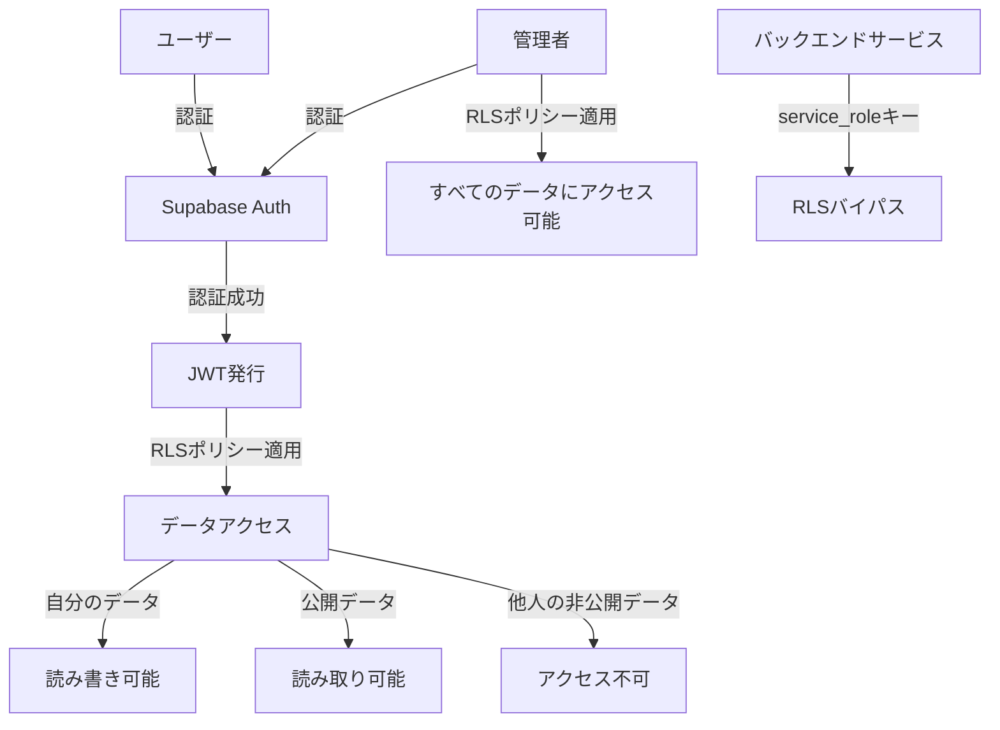
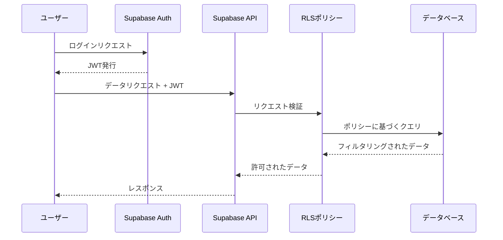

# Supabaseデータベースセキュリティとポリシー設計 - tradechat-mvp

## 1. 概要

このドキュメントでは、tradechat-mvpプロジェクトのSupabaseデータベースに対するセキュリティとRow Level Security（RLS）ポリシーの詳細設計について説明します。この設計は、[データベースアーキテクチャ設計](./supabase-database-architecture.md)に基づいています。

## 2. テーブル構造の拡張

既存のデータモデルに以下の変更を加えます：

1. **usersテーブル**に`is_admin`フラグを追加
   ```sql
   ALTER TABLE users ADD COLUMN is_admin BOOLEAN DEFAULT FALSE;
   ```

2. **entriesテーブル**に`is_public`フラグを追加
   ```sql
   ALTER TABLE entries ADD COLUMN is_public BOOLEAN DEFAULT FALSE;
   ```

## 3. RLSポリシー設計

### 3.1 基本方針

- 最小権限の原則：ユーザーは必要最小限のデータにのみアクセス可能
- データの所有権：基本的に自分のデータのみアクセス可能
- 公開/非公開の区別：公開設定されたデータは他のユーザーも閲覧可能
- 管理者特権：管理者はすべてのデータにアクセス可能
- RLSポリシーは「OR」条件で評価：どれか1つのポリシーが「true」を返せばアクセス許可

### 3.2 各テーブルのRLSポリシー

#### users テーブル
```sql
-- RLSを有効化
ALTER TABLE users ENABLE ROW LEVEL SECURITY;

-- 自分自身のデータのみ読み取り可能
CREATE POLICY "ユーザーは自分のデータのみ閲覧可能" ON users
  FOR SELECT USING (auth.uid() = id);

-- 自分自身のデータのみ更新可能
CREATE POLICY "ユーザーは自分のデータのみ更新可能" ON users
  FOR UPDATE USING (auth.uid() = id);

-- 管理者はすべてのユーザーデータにアクセス可能
CREATE POLICY "管理者はすべてのユーザーデータにアクセス可能" ON users
  FOR ALL USING (auth.uid() IN (SELECT id FROM users WHERE is_admin = true));
```

#### profiles テーブル
```sql
-- RLSを有効化
ALTER TABLE profiles ENABLE ROW LEVEL SECURITY;

-- 自分のプロフィールは読み書き可能
CREATE POLICY "ユーザーは自分のプロフィールを管理可能" ON profiles
  FOR ALL USING (auth.uid() = user_id);

-- 公開プロフィールは誰でも閲覧可能
CREATE POLICY "公開プロフィールは誰でも閲覧可能" ON profiles
  FOR SELECT USING (true);

-- 管理者はすべてのプロフィールにアクセス可能
CREATE POLICY "管理者はすべてのプロフィールにアクセス可能" ON profiles
  FOR ALL USING (auth.uid() IN (SELECT id FROM users WHERE is_admin = true));
```

#### chat_messages テーブル
```sql
-- RLSを有効化
ALTER TABLE chat_messages ENABLE ROW LEVEL SECURITY;

-- 自分のメッセージは読み書き可能
CREATE POLICY "ユーザーは自分のメッセージを管理可能" ON chat_messages
  FOR ALL USING (auth.uid() = user_id);

-- 公開メッセージは誰でも閲覧可能
CREATE POLICY "公開メッセージは誰でも閲覧可能" ON chat_messages
  FOR SELECT USING (is_public = true);

-- 管理者はすべてのメッセージにアクセス可能
CREATE POLICY "管理者はすべてのメッセージにアクセス可能" ON chat_messages
  FOR ALL USING (auth.uid() IN (SELECT id FROM users WHERE is_admin = true));
```

#### chat_images テーブル
```sql
-- RLSを有効化
ALTER TABLE chat_images ENABLE ROW LEVEL SECURITY;

-- 自分の画像は読み書き可能
CREATE POLICY "ユーザーは自分の画像を管理可能" ON chat_images
  FOR ALL USING (auth.uid() = user_id);

-- 公開メッセージに関連する画像は誰でも閲覧可能
CREATE POLICY "公開メッセージの画像は誰でも閲覧可能" ON chat_images
  FOR SELECT USING (
    id IN (
      SELECT image_id FROM chat_messages 
      WHERE is_public = true AND image_id IS NOT NULL
    )
  );

-- 管理者はすべての画像にアクセス可能
CREATE POLICY "管理者はすべての画像にアクセス可能" ON chat_images
  FOR ALL USING (auth.uid() IN (SELECT id FROM users WHERE is_admin = true));
```

#### entries テーブル
```sql
-- RLSを有効化
ALTER TABLE entries ENABLE ROW LEVEL SECURITY;

-- 自分のエントリーは読み書き可能
CREATE POLICY "ユーザーは自分のエントリーを管理可能" ON entries
  FOR ALL USING (auth.uid() = user_id);

-- 公開エントリーは誰でも閲覧可能
CREATE POLICY "公開エントリーは誰でも閲覧可能" ON entries
  FOR SELECT USING (is_public = true);

-- 管理者はすべてのエントリーにアクセス可能
CREATE POLICY "管理者はすべてのエントリーにアクセス可能" ON entries
  FOR ALL USING (auth.uid() IN (SELECT id FROM users WHERE is_admin = true));
```

#### symbol_settings テーブル
```sql
-- RLSを有効化
ALTER TABLE symbol_settings ENABLE ROW LEVEL SECURITY;

-- 自分のシンボル設定のみ読み書き可能
CREATE POLICY "ユーザーは自分のシンボル設定のみ管理可能" ON symbol_settings
  FOR ALL USING (auth.uid() = user_id);

-- 管理者はすべてのシンボル設定にアクセス可能
CREATE POLICY "管理者はすべてのシンボル設定にアクセス可能" ON symbol_settings
  FOR ALL USING (auth.uid() IN (SELECT id FROM users WHERE is_admin = true));
```

#### chart_settings テーブル
```sql
-- RLSを有効化
ALTER TABLE chart_settings ENABLE ROW LEVEL SECURITY;

-- 自分のチャート設定のみ読み書き可能
CREATE POLICY "ユーザーは自分のチャート設定のみ管理可能" ON chart_settings
  FOR ALL USING (auth.uid() = user_id);

-- 管理者はすべてのチャート設定にアクセス可能
CREATE POLICY "管理者はすべてのチャート設定にアクセス可能" ON chart_settings
  FOR ALL USING (auth.uid() IN (SELECT id FROM users WHERE is_admin = true));
```

#### indicator_settings テーブル
```sql
-- RLSを有効化
ALTER TABLE indicator_settings ENABLE ROW LEVEL SECURITY;

-- 自分のインジケーター設定のみ読み書き可能
CREATE POLICY "ユーザーは自分のインジケーター設定のみ管理可能" ON indicator_settings
  FOR ALL USING (auth.uid() = user_id);

-- 管理者はすべてのインジケーター設定にアクセス可能
CREATE POLICY "管理者はすべてのインジケーター設定にアクセス可能" ON indicator_settings
  FOR ALL USING (auth.uid() IN (SELECT id FROM users WHERE is_admin = true));
```

#### cached_data テーブル
```sql
-- RLSを有効化
ALTER TABLE cached_data ENABLE ROW LEVEL SECURITY;

-- キャッシュデータは誰でも読み取り可能
CREATE POLICY "キャッシュデータは誰でも読み取り可能" ON cached_data
  FOR SELECT USING (true);

-- 管理者のみがキャッシュデータを管理可能
CREATE POLICY "管理者のみがキャッシュデータを管理可能" ON cached_data
  FOR INSERT USING (auth.uid() IN (SELECT id FROM users WHERE is_admin = true));

CREATE POLICY "管理者のみがキャッシュデータを更新可能" ON cached_data
  FOR UPDATE USING (auth.uid() IN (SELECT id FROM users WHERE is_admin = true));

CREATE POLICY "管理者のみがキャッシュデータを削除可能" ON cached_data
  FOR DELETE USING (auth.uid() IN (SELECT id FROM users WHERE is_admin = true));
```

#### user_relations テーブル
```sql
-- RLSを有効化
ALTER TABLE user_relations ENABLE ROW LEVEL SECURITY;

-- 自分のフォロー関係は読み書き可能
CREATE POLICY "ユーザーは自分のフォロー関係を管理可能" ON user_relations
  FOR ALL USING (auth.uid() = follower_id);

-- フォロワー/フォロー関係は誰でも閲覧可能
CREATE POLICY "フォロー関係は誰でも閲覧可能" ON user_relations
  FOR SELECT USING (true);

-- 管理者はすべてのフォロー関係にアクセス可能
CREATE POLICY "管理者はすべてのフォロー関係にアクセス可能" ON user_relations
  FOR ALL USING (auth.uid() IN (SELECT id FROM users WHERE is_admin = true));
```

#### backtest_data テーブル
```sql
-- RLSを有効化
ALTER TABLE backtest_data ENABLE ROW LEVEL SECURITY;

-- 自分のバックテストデータのみ読み書き可能
CREATE POLICY "ユーザーは自分のバックテストデータのみ管理可能" ON backtest_data
  FOR ALL USING (auth.uid() = user_id);

-- 管理者はすべてのバックテストデータにアクセス可能
CREATE POLICY "管理者はすべてのバックテストデータにアクセス可能" ON backtest_data
  FOR ALL USING (auth.uid() IN (SELECT id FROM users WHERE is_admin = true));
```

## 4. 認証機能との連携

### 4.1 Supabase認証設定

1. **メール/パスワード認証の設定**
   - サインアップ時のメール確認を有効化
   - パスワードの最小長と複雑さの要件を設定

2. **Googleログインの設定**
   - OAuth設定の構成
   - リダイレクトURLの設定

3. **認証フロー**
   - サインアップ
   - ログイン
   - パスワードリセット
   - メール確認

### 4.2 APIアクセス制御

1. **APIキーの管理**
   - 匿名キー（anon key）: 認証されていないユーザーが使用
   - サービスキー（service_role key）: バックエンドサービスが使用（RLSをバイパス）

2. **バックエンドサービスのアクセス制御**
   - サーバーサイドからのアクセスはservice_roleキーを使用してRLSをバイパス
   - 必要最小限の操作のみを許可するように設計

## 5. セキュリティリスクとその対策

### 5.1 SQLインジェクション対策

- パラメータ化されたクエリの使用
- ユーザー入力の適切なバリデーション

### 5.2 クロスサイトスクリプティング（XSS）対策

- ユーザー入力のサニタイズ
- Content Security Policy（CSP）の設定

### 5.3 認証関連のリスク対策

- 強力なパスワードポリシーの設定
- 多要素認証（MFA）の実装
- セッション管理の適切な設定

### 5.4 データ漏洩対策

- 機密データの暗号化
- アクセスログの監視
- 定期的なセキュリティ監査

## 6. 実装計画

### 6.1 フェーズ1: テーブル構造の拡張（1日）

- usersテーブルにis_adminフラグを追加
- entriesテーブルにis_publicフラグを追加

### 6.2 フェーズ2: RLSポリシーの実装（2日）

- 各テーブルでRLSを有効化
- 各テーブルに対して上記のRLSポリシーを実装

### 6.3 フェーズ3: 認証機能の設定（1日）

- Supabase認証の設定
- APIアクセス制御の実装

### 6.4 フェーズ4: テストと検証（2日）

- 各ロールでのアクセス権限のテスト
- エッジケースのテスト
- セキュリティ監査

## 7. セキュリティモデル図



## 8. データアクセスフロー



この設計により、tradechat-mvpプロジェクトのSupabaseデータベースに対する適切なセキュリティとRLSポリシーが実現されます。