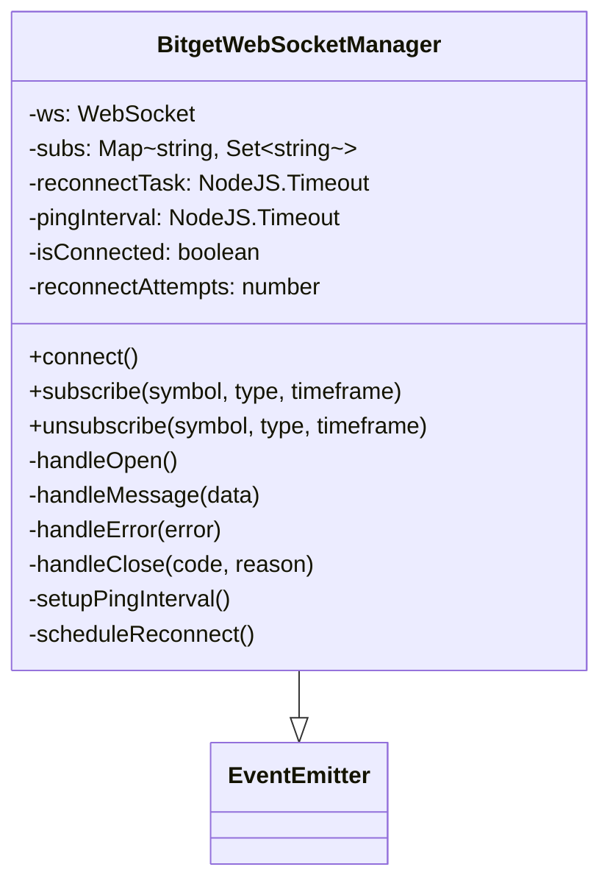
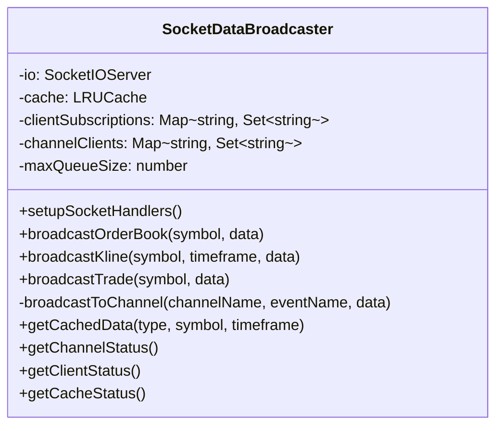
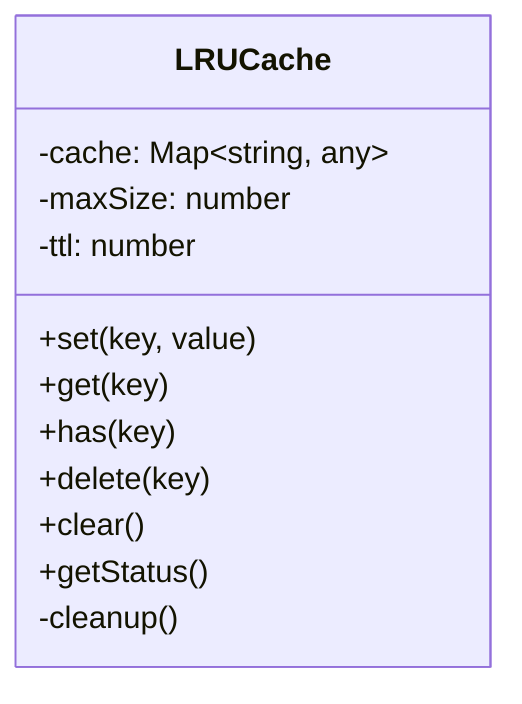
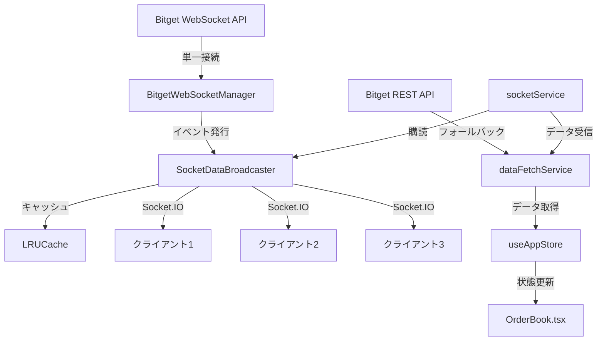
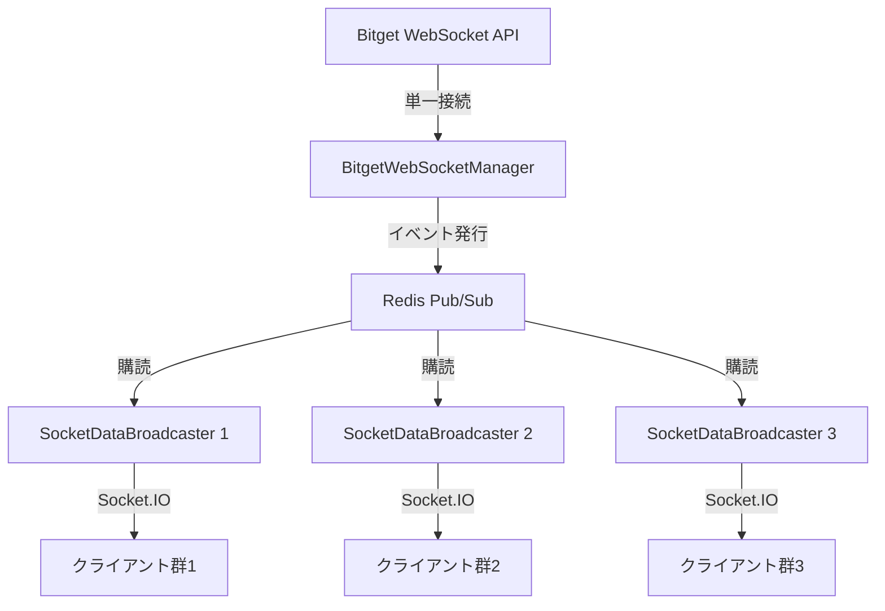
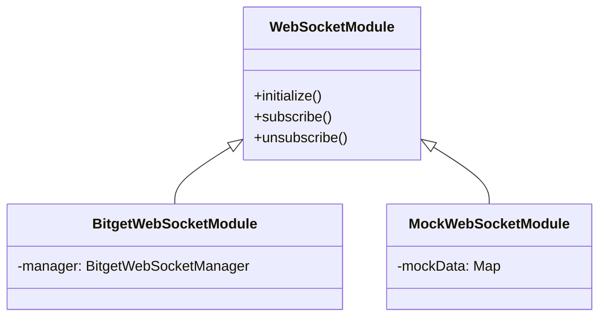

# WebSocketの共有データ方式の実装計画

## 1. 現状分析

現在のシステムは「クライアント個別接続方式」を採用しており、以下の特徴があります：

- 各クライアントが個別にBitget WebSocketに接続
- サーバーサイドでは5秒間のキャッシュ機能あり
- クライアントサイドでは30秒間のキャッシュ機能あり
- 複数クライアントが同じシンボルを表示する場合でも、各クライアントが個別にAPIリクエストを実行

## 2. 設計要件

### 2.1 Bitget WebSocketとの単一接続管理
- サーバーサイドで単一のWebSocket接続を管理
- **すべてのシンボルを同等にサポート**
- 接続状態監視と自動再接続機能

### 2.2 Socket.IOを使用したデータ配信
- サーバーからクライアントへのデータ配信
- シンボルごとのデータ配信チャネル
- クライアント購読管理

### 2.3 サーバーサイドキャッシュ
- WebSocketデータのメモリ内保持
- キャッシュ管理の最適化（LRU戦略）
- 水平スケール時のPub/Sub対応（Redis等）

### 2.4 クライアントサイド実装
- `services/socketService.ts`の修正
- `services/bitgetApi.ts`の変更
- `services/dataFetchService.ts`のキャッシュ戦略の見直し

### 2.5 エラーハンドリングと冗長性
- 接続障害検出と回復メカニズム
- APIフォールバック機能
- バックプレッシャー制御

## 3. 実装計画

### 3.1 ディレクトリ構造とファイル変更

#### 3.1.1 新規作成するファイル
- `server/bitgetWebSocketManager.ts` - サーバーサイドでBitget WebSocketとの単一接続を管理
- `server/socketDataBroadcaster.ts` - Socket.IOを使用したデータ配信を管理
- `server/cacheManager.ts` - LRUキャッシュ管理を実装
- `types/websocket.ts` - WebSocket関連の型定義

#### 3.1.2 修正が必要な既存ファイル
- `server.js` - WebSocketマネージャーとデータブロードキャスターの統合
- `services/socketService.ts` - クライアント側のSocket.IO接続管理の修正
- `services/bitgetApi.ts` - WebSocket接続部分の修正
- `services/dataFetchService.ts` - キャッシュ戦略の見直し
- `components/market/OrderBook.tsx` - データ取得方法の修正
- `store/useAppStore.ts` - データフェッチロジックの修正

### 3.2 サーバーサイドの実装

#### 3.2.1 `BitgetWebSocketManager`クラス設計



主な機能：
- Bitget WebSocketとの単一接続を管理
- **すべてのシンボルを同等にサポート**
- 接続状態監視と自動再接続機能
- 指数バックオフ+ジッターによる再接続戦略
- イベントエミッターとしての実装（データ受信時にイベントを発行）

#### 3.2.2 `SocketDataBroadcaster`クラス設計



主な機能：
- Socket.IOを使用したデータ配信
- シンボルごとのデータ配信チャネル管理
- クライアント購読管理（クライアントIDとチャネルの関連付け）
- バックプレッシャー制御（送信キューのオーバーフロー検出）
- キャッシュデータの管理と新規接続クライアントへの即時送信

#### 3.2.3 `LRUCache`クラス設計



主な機能：
- LRUキャッシュの実装
- キャッシュサイズの制限
- キャッシュエントリの有効期限管理
- キャッシュ統計情報の提供

### 3.3 `server.js`の修正

```javascript
// BitgetWebSocketManagerとSocketDataBroadcasterの初期化
bitgetWsManager = new BitgetWebSocketManager();
socketDataBroadcaster = new SocketDataBroadcaster(io, 100); // キャッシュサイズ100

// BitgetWebSocketManagerのイベントリスナー設定
bitgetWsManager.on('orderbook', (data) => {
  const { symbol, data: orderBookData } = data;
  socketDataBroadcaster.broadcastOrderBook(symbol, orderBookData);
});

bitgetWsManager.on('kline', (data) => {
  const { symbol, data: klineData, channel } = data;
  // チャネル名からタイムフレームを抽出（例: candle1m → 1m）
  const timeframe = channel.replace('candle', '');
  socketDataBroadcaster.broadcastKline(symbol, timeframe, klineData);
});

// 接続を開始
bitgetWsManager.connect();

// グローバル関数として公開
global.subscribeSymbol = (symbol, type, timeframe) => {
  bitgetWsManager.subscribe(symbol, type, timeframe);
  return true;
};
```

### 3.4 クライアントサイドの実装

#### 3.4.1 `socketService.ts`の修正

```typescript
// Socket.IOの名前空間
const NAMESPACE = {
  MARKET: '/market'
};

// チャネル名の定数
const CHANNEL = {
  ORDERBOOK: 'orderbook',
  KLINE: 'kline',
  TRADE: 'trade',
  SUBSCRIBE: 'subscribe',
  UNSUBSCRIBE: 'unsubscribe'
};

export const socketService = {
  // マーケットデータ用のSocket.IO接続を初期化
  initializeMarketSocket(): Socket | null {
    // 実装...
  },
  
  // オーダーブックデータを購読
  subscribeOrderBook(symbol: string, callback: (data: any) => void): () => void {
    // 実装...
  },
  
  // キャンドルデータを購読
  subscribeKline(symbol: string, timeframe: string, callback: (data: any) => void): () => void {
    // 実装...
  }
};
```

#### 3.4.2 `dataFetchService.ts`の修正

```typescript
// WebSocketサブスクリプション管理
const subscriptions = new Map<string, () => void>();

export const dataFetchService = {
  // オーダーブックデータ取得 - WebSocket版
  fetchOrderBookWS: async (
    symbol: string,
    exchangeType: ExchangeType,
    signal?: AbortSignal,
    useCache: boolean = true
  ): Promise<OrderBookData> => {
    // WebSocketサブスクリプションの管理
    // REST APIへのフォールバック機能
    // 実装...
  },
  
  // チャートデータ取得 - WebSocket版
  fetchChartDataWS: async (
    symbol: string,
    timeFrame: Timeframe,
    exchangeType: ExchangeType,
    signal?: AbortSignal,
    useCache: boolean = true
  ): Promise<OHLCData[]> => {
    // 実装...
  }
};
```

### 3.5 データフローの図式的な説明



## 4. スケーラビリティとメンテナンス性の強化

### 4.1 スケーラビリティの強化



スケーラビリティ強化のポイント：
- Redis Pub/Subを使用したインスタンス間通信
- セッション永続化によるロードバランシング対応
- キャッシュの分散管理
- 負荷に応じた動的スケーリング

### 4.2 メンテナンス性の強化



メンテナンス性強化のポイント：
- インターフェースベースの設計
- 依存性の明確な分離
- 単体テスト可能な構造
- モック実装によるテスト容易性
- 詳細なログ記録とモニタリング

## 5. 実装の優先順位とステップバイステップの計画

1. **サーバーサイドの基盤実装**
   - `types/websocket.ts` - WebSocket関連の型定義
   - `server/cacheManager.ts` - LRUキャッシュ管理
   - `server/bitgetWebSocketManager.ts` - Bitget WebSocket接続管理
   - `server/socketDataBroadcaster.ts` - Socket.IOデータ配信

2. **サーバーサイドの統合**
   - `server.js` - WebSocketマネージャーとデータブロードキャスターの統合

3. **クライアントサイドの実装**
   - `services/socketService.ts` - Socket.IO接続管理の修正
   - `services/dataFetchService.ts` - WebSocketデータ取得の実装
   - `services/bitgetApi.ts` - WebSocket接続部分の修正

4. **アプリケーションロジックの修正**
   - `store/useAppStore.ts` - データフェッチロジックの修正
   - `components/market/OrderBook.tsx` - データ取得方法の修正

5. **テストと最適化**
   - 単体テスト - 各コンポーネントの機能テスト
   - 統合テスト - 全体の動作確認
   - パフォーマンス最適化 - キャッシュ戦略の調整
   - エラーハンドリングの強化 - エッジケースの対応

## 6. 期待される効果

1. **APIレートリミット回避**
   - Bitgetとのソケットは1本のみなのでAPI制限を最小化

2. **レイテンシ低減**
   - クライアントはSocket.IO 1 hopだけで最新データを受信
   - 数秒の遅延は許容可能

3. **スケーラビリティ向上**
   - 接続処理がサーバー側に閉じるため、後からEdge/Serverlessにも対応可能
   - 水平スケールによる高負荷対応

4. **コード責務分離**
   - BitgetWebSocketManagerとSocketDataBroadcasterにより「取引所↔サーバ」と「サーバ↔クライアント」を分離

5. **メンテナンス性向上**
   - 明確な責務分離により、各コンポーネントの変更が他に影響しにくい設計
   - インターフェースベースの設計によるテスト容易性

6. **型安全性の向上**
   - WebSocketメッセージの型定義による早期エラー検出

7. **バックプレッシャー制御**
   - クライアント送信キューのオーバーフロー検出と対応
